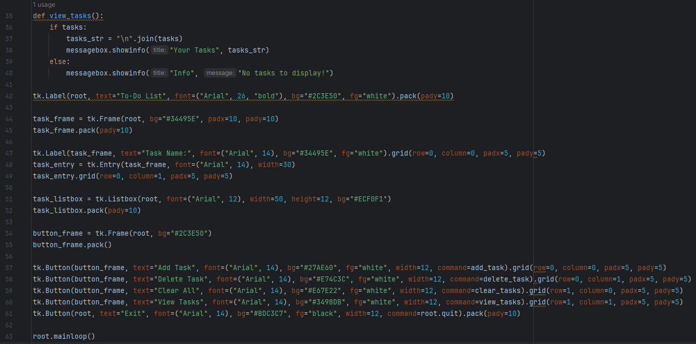
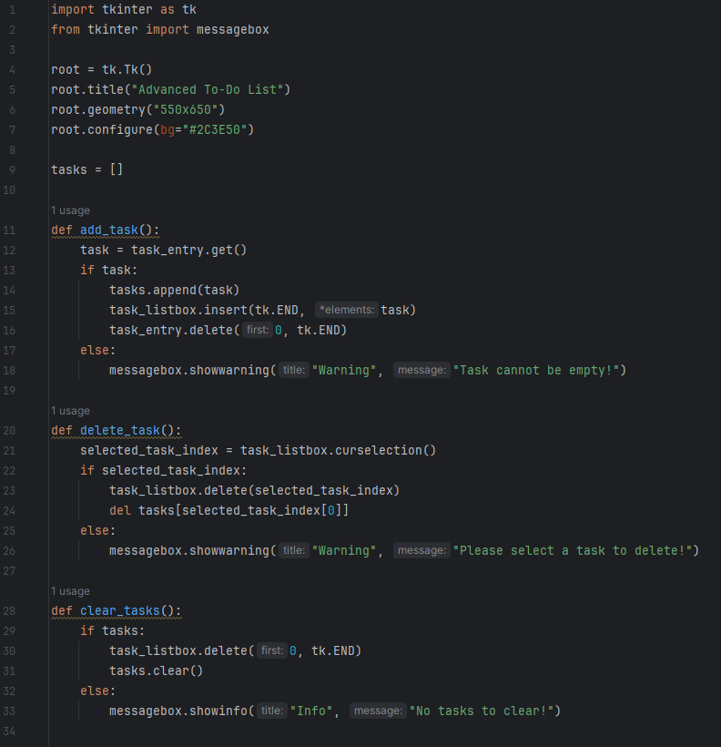
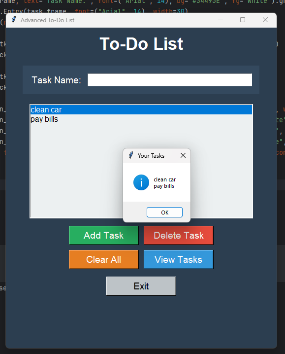
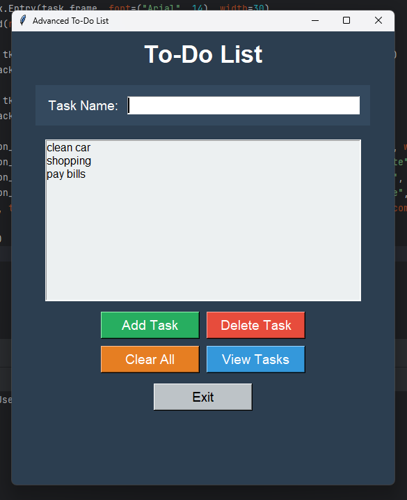
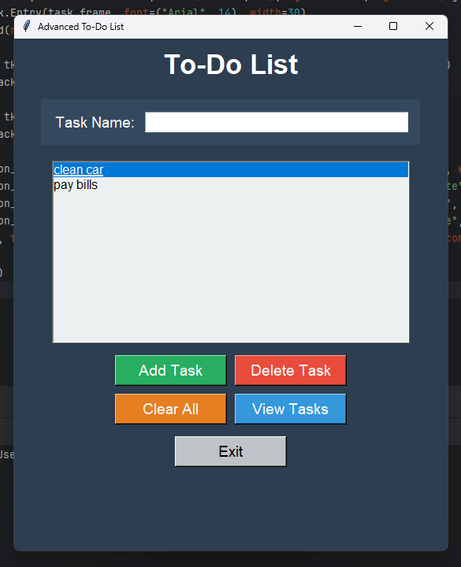

# ✅ To-Do List — Python Desktop GUI Task Manager

> A feature-rich, dark-themed desktop task management application built with Python and Tkinter, supporting full CRUD operations — Add, Delete, Clear All, and View tasks — through an intuitive multi-button GUI.

🎬 **Watch the Demo Video — To-Do List:** [Google Drive Demo Video](https://drive.google.com/file/d/1I8ruUbltYd9CJrHj9L0T-5_wL6ak8qR0/view?usp=drive_link)

[](https://www.python.org/)
[](https://docs.python.org/3/library/tkinter.html)
[](LICENSE)

---

## 🌟 Overview

The **To-Do List** is a practical, Tkinter-based graphical desktop task manager built as part of the **BiStartX** Python learning curriculum. Users can type a task name into the input field and manage their personal task list through four dedicated operations — **Add**, **Delete**, **Clear All**, and **View** — all with real-time feedback via a scrollable Listbox and popup dialogs.

The app maintains two synchronized data structures — a Python `list` for in-memory state and a Tkinter `Listbox` for visual display — demonstrating key programming patterns like CRUD operations, list indexing, selection handling, and state synchronization between model and view.

---

## 📸 Screenshots

### Main Application Window
<p align="center">
  
</p>

### Adding & Managing Tasks
<p align="center">
   &nbsp;&nbsp;
  
</p>

### Dialogs & Validation
<p align="center">
   &nbsp;&nbsp;
  
</p>

---

## ✨ Features

- **➕ Add Task**: Appends a new task to both the in-memory `tasks` list and the Tkinter `Listbox`. Clears the input field after successful addition. Shows a warning dialog if the field is empty.
- **🗑️ Delete Task**: Removes the currently selected task from the `Listbox` using `curselection()` and syncs deletion from the `tasks` list via index. Shows a warning if no task is selected.
- **🧹 Clear All**: Empties the entire task list at once using `task_listbox.delete(0, tk.END)` and `tasks.clear()`. Shows an info dialog if the list is already empty.
- **👁️ View Tasks**: Opens a popup dialog displaying all current tasks as a newline-joined summary string. Shows an info dialog if there are no tasks.
- **⚠️ Input Validation & Feedback**: Every action has proper guard clauses with contextual `messagebox` dialogs:
  - Empty task name → `showwarning`
  - No task selected for deletion → `showwarning`
  - No tasks to clear → `showinfo`
  - No tasks to view → `showinfo`
- **🖤 Dark-Themed UI**: Consistent dark slate-blue theme (`#2C3E50`) with a lighter inner panel (`#34495E`) for the input frame, and color-coded action buttons:
  - 🟢 **Add Task** — Green (`#27AE60`)
  - 🔴 **Delete Task** — Red (`#E74C3C`)
  - 🟠 **Clear All** — Orange (`#E67E22`)
  - 🔵 **View Tasks** — Blue (`#3498DB`)
  - ⬜ **Exit** — Light gray (`#BDC3C7`)
- **📋 Listbox Display**: A `tk.Listbox` widget (12 rows, 50 chars wide) provides a clean, scrollable task view with a light background (`#ECF0F1`) for contrast against the dark theme.

---

## 🛠️ Tech Stack

| Component | Technology |
| :--- | :--- |
| **Language** | Python 3.8+ |
| **GUI Framework** | `tkinter` (Python Standard Library) |
| **Dialog Boxes** | `tkinter.messagebox` |
| **Task Storage** | Python `list` (in-memory) |
| **IDE** | PyCharm |

---

## 📁 Project Structure

```
To-do-list/
│
├── ToDoList.py            # Main application — GUI layout and CRUD task logic
├── 4444.docx              # Project documentation with screenshots & activity log
├── screenshots/
│   ├── screenshot_1.png   # Main window (empty state)
│   ├── screenshot_2.png   # Tasks added and visible in Listbox
│   ├── screenshot_3.png   # "View Tasks" popup dialog
│   ├── screenshot_4.png   # Empty task warning dialog
│   ├── screenshot_5.png   # No tasks to clear info dialog
│   └── screenshot_6.png   # No task selected warning dialog
└── README.md
```

---

## ⚙️ How It Works

```
User types a task name → clicks [Add Task]
  ├─ Empty input?    → showwarning dialog (no change)
  └─ Has text?       → tasks.append(task)
                       task_listbox.insert(END, task)
                       task_entry.delete(0, END)

User selects a task → clicks [Delete Task]
  ├─ No selection?   → showwarning dialog (no change)
  └─ Has selection?  → task_listbox.delete(index)
                       del tasks[index]

User clicks [Clear All]
  ├─ List empty?     → showinfo dialog (no change)
  └─ Has tasks?      → task_listbox.delete(0, END)
                       tasks.clear()

User clicks [View Tasks]
  ├─ List empty?     → showinfo dialog ("No tasks to display!")
  └─ Has tasks?      → showinfo dialog with "\n".join(tasks)

User clicks [Exit]  → root.quit()
```

---

## 🚀 Getting Started

### Prerequisites
- **Python 3.8** or higher (`tkinter` and `messagebox` are part of Python's standard library)

### Run the App

**1. Clone the Repository:**
```bash
git clone https://github.com/AnasQ2003/To-do-list.git
cd To-do-list
```

**2. Launch the Application:**
```bash
python ToDoList.py
```

Type a task in the input field and click **Add Task** to begin!

---

## 💡 Key Concepts Demonstrated

| Concept | How It's Used |
| :--- | :--- |
| **Lists** | `tasks = []` stores tasks in-memory; synced with Listbox |
| **List Methods** | `.append()`, `.clear()`, `del tasks[i]` for CRUD operations |
| **`tk.Listbox`** | Visual display of tasks; `.insert()`, `.delete()`, `.curselection()` |
| **Index Synchronization** | `curselection()` returns selected index, used to `del tasks[i]` |
| **Guard Clauses** | Early returns with `messagebox` dialogs for invalid states |
| **`tk.Frame`** | Groups input label + entry into a structured inner panel |
| **Grid + Pack Layout** | `grid()` for the button panel; `pack()` for top-level widgets |
| **String Joining** | `"\n".join(tasks)` formats task list for the View dialog |

---

## 🧠 Learning Objectives (BiStartX Week 4)

> ✅ **Objective**: Master Python data structures — particularly lists — and understand how to perform CRUD (Create, Read, Update, Delete) operations programmatically while keeping a GUI display synchronized with in-memory state.

**Activities Completed:**
- ✔️ Studied Python lists and their core methods: `.append()`, `.clear()`, `del`.
- ✔️ Practiced index-based access and deletion from lists using `curselection()`.
- ✔️ Learned to keep two data structures (Python list + Listbox) in sync.
- ✔️ Built a fully functional CRUD task manager as a real-world application.
- ✔️ Applied input validation patterns using guard clauses and `messagebox` dialogs.

**Key Takeaways:**
- Lists are the foundational dynamic data structure in Python — versatile and essential.
- Keeping a model (list) and view (Listbox) in sync is a fundamental UI programming pattern.
- Guard clauses with early returns are a clean way to handle invalid states before processing.
- A well-structured button layout with color-coded actions significantly improves UX.

---

## 📄 License

```
MIT License

Copyright (c) To Do List---2026 AnasQ2003

Permission is hereby granted, free of charge, to any person obtaining a copy
of this software and associated documentation files (the "Software"), to deal
in the Software without restriction, including without limitation the rights
to use, copy, modify, merge, publish, distribute, sublicense, and/or sell
copies of the Software, and to permit persons to whom the Software is
furnished to do so, subject to the following conditions:

The above copyright notice and this permission notice shall be included in all
copies or substantial portions of the Software.

THE SOFTWARE IS PROVIDED "AS IS", WITHOUT WARRANTY OF ANY KIND, EXPRESS OR
IMPLIED, INCLUDING BUT NOT LIMITED TO THE WARRANTIES OF MERCHANTABILITY,
FITNESS FOR A PARTICULAR PURPOSE AND NONINFRINGEMENT.
```

---

## 👨‍💻 Author

**Anas Ahmed Qureshi.** — [@AnasQ2003](https://github.com/AnasQ2003)

---

<div align="center">
  <p>Built with ❤️ by <strong>Anas</strong></p>
  
 <div align="center">

Made with 💧 and a lot of ☕

**⭐ If you found this useful, please star the repository!**

*Stay hydrated. Stay healthy.*

</div>

